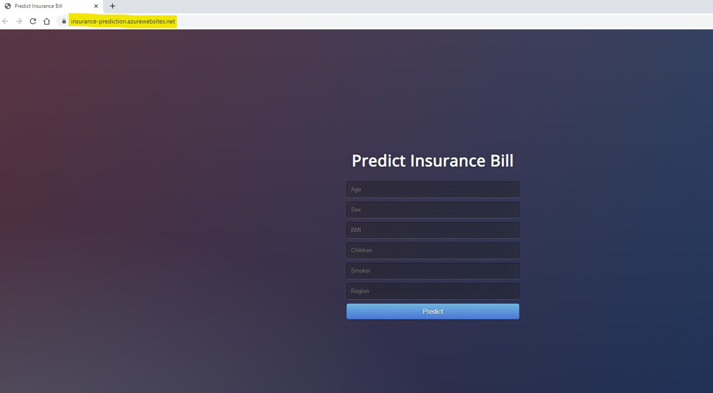

# Build and deploy machine learning web app - Predict patient hospitalization

## First solution
* Develop a machine learning pipline and train models using PyCaret
* Build a simple web app using Flask framework
* Deploy the web app on Heroku

## Secound solution
* Using the same trained model and Flask framework as in the first solution
* Build a Docker file on local computer and publish it to Azure Container Registry (ACR)
* Deploy the web app on Azure using the container that has been uploaded into ACR

  

**Note**: By the time this repo is published, the app from https://insurance-prediction.azurewebsites.net will be removed to restrict resource consumption.
